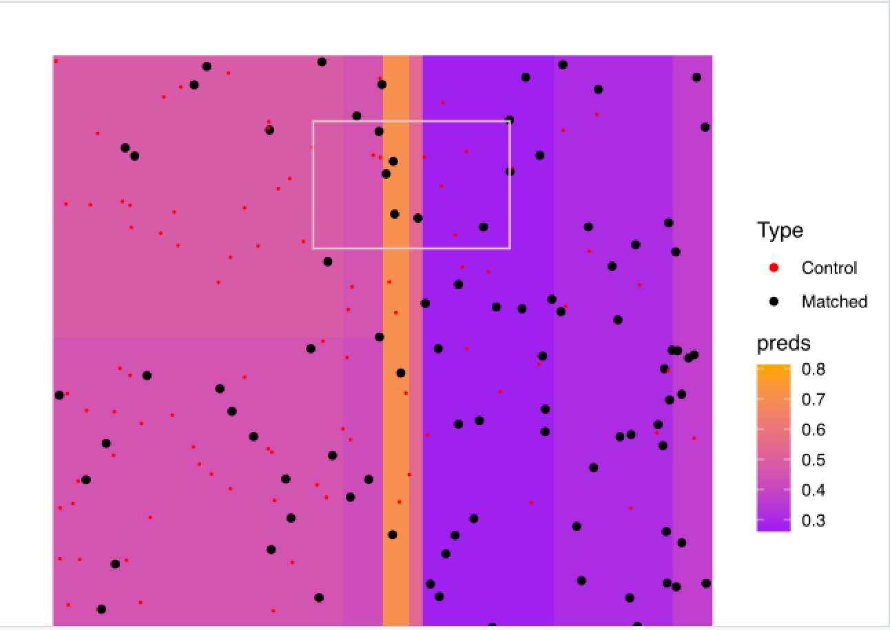
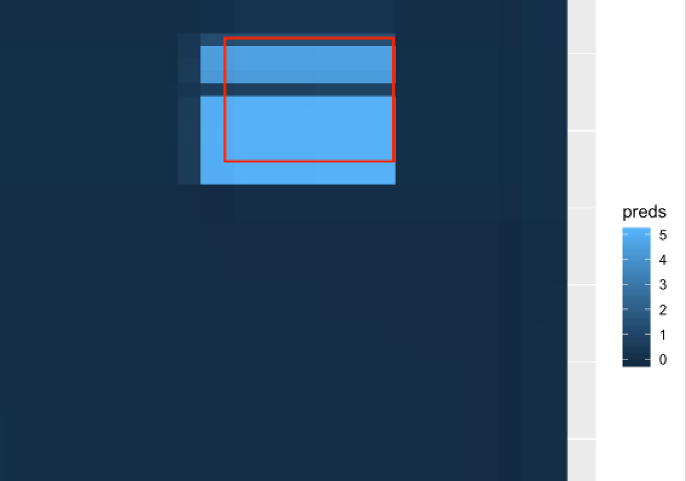

```{r setup, include=FALSE}
knitr::opts_chunk$set(echo = FALSE)
```

# What We Changed 

The biggest improvement to our method was the change back to BART from XGBoost. XGBoost, even with cross-validation, just consistently makes worse predictions. Remember that example where the mean outcome in the box is 5 and outside is 0? Here's how XGBoost's predictions (left) compare to BART's (right) in that case (you can ignore the color differences and the fact that there are points in one and not in the other):

{width=300px} {width=300px}

Note also that the range of values for XGBoost is (0.3, 0.8), vs. BART's (0, 5).

So long story short, we switched back to BART and now everything is doing much better. 

## Changes to the Greedy Algorithm
Recall that the greedy was extremely sensitive to the choice of hyperparameter governing the stopping rule. This behavior is essentially entirely eliminated with the better predictions that BART provides. 

Recall also that the stopping rule was "if the variance of predicted outcomes in the region we're expanding to is a lot bigger than it was on the last expansion, stop; else, keep expanding". We tried instead to estimate (directly) the slope of the outcome function in the new region and use that quantity as a stopping criterion but it performed more slowly with no difference in performance so we stuck to the original. 

## Changes to the MIP 

# Results 

# To Do

## Overall

## Greedy Algorithm 
Parallelize the C++ code 

## MIP